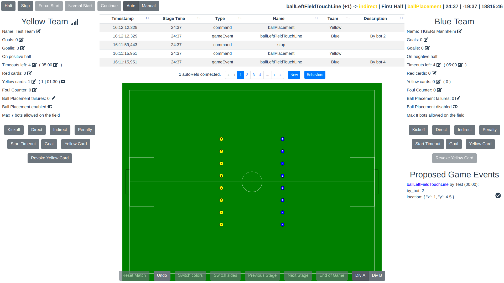

[](https://circleci.com/gh/RoboCup-SSL/ssl-game-controller/tree/master)
[](https://goreportcard.com/report/github.com/RoboCup-SSL/ssl-game-controller)
[](https://godoc.org/github.com/RoboCup-SSL/ssl-game-controller)
[](https://github.com/RoboCup-SSL/ssl-game-controller/releases/latest)
[](https://circleci.com/api/v1.1/project/github/RoboCup-SSL/ssl-game-controller/latest/artifacts/0/coverage?branch=master)

# ssl-game-controller

The game controller for matches in the RoboCup Small Size league, introduced at RoboCup 2019 as a replacement of
the [ssl-refbox](https://github.com/RoboCup-SSL/ssl-refbox).



## Add your team name

If you are a new team, please add your team name to [internal/app/engine/config.go](internal/app/engine/config.go).

## Usage

If you just want to use this app, simply download the
latest [release binary](https://github.com/RoboCup-SSL/ssl-game-controller/releases/latest). The binary is
self-contained. No dependencies are required.

You can also use pre-build docker images:

```shell script
docker pull robocupssl/ssl-game-controller
# Run GC with default configuration
docker run -p 8081:8081 robocupssl/ssl-game-controller
# Mount local directories 
docker run -p 8081:8081 \
  # Local config dir
  -v "$(pwd)"/config:/config \
  # Local data dir (current state)
  -v "$(pwd)"/data:/data \
  robocupssl/ssl-game-controller
```

The controller will generate a default config to [config/](./config/) on the first start. Afterwards, you can change all
settings there.

For example, if you want to add a new team name temporarily, you can add it
to [config/engine.yaml](./config/engine.yaml). If you want to add your team persistently, add it to `defaultTeams`
in [internal/app/engine/config.go](internal/app/engine/config.go) and create a pull request on GitHub.

### Runtime Requirements

* No software dependencies (except for development, see below)
* pre-build binaries: 64bit Linux, Windows, OSX
* A reasonable Web-Browser (mostly tested on Chrome)

### External Runtime Dependencies

[ssl-vision](https://github.com/RoboCup-SSL/ssl-vision) - Receive Geometry packages for correct field dimensions.   
If not available, make sure to configure the correct dimensions
in [config/ssl-game-controller.yaml](config/ssl-game-controller.yaml).

tracker-source implementation that produces
[TrackerWrapperPacket](https://github.com/RoboCup-SSL/ssl-vision/blob/master/src/shared/proto/messages_robocup_ssl_wrapper_tracked.proto) -
Get ball and robot positions.      
Required for:
 * Check ball placement progress
 * Check for correct number of robots per team
 * Check if game can continue (ball and robots prepared)
 * Check for "no progress"
 * Check if keeper may be changed via team protocol

The [TIGERs AutoRef](https://github.com/TIGERs-Mannheim/AutoReferee) and
the [ER-Force AutoRef](https://github.com/robotics-erlangen/autoref) are tracker-source implementations.
If no tracker-source is available, the above features will not work.

### Reference Clients
There are some reference clients:
 * [ssl-ref-client](./cmd/ssl-ref-client): A client that receives referee messages
 * [ssl-auto-ref-client](./cmd/ssl-auto-ref-client/README.md): A client that connects to the controller as an autoRef
 * [ssl-team-client](./cmd/ssl-team-client/README.md): A client that connects to the controller as a team
 * [ssl-remote-control-client](./cmd/ssl-remote-control-client/README.md): A client that connects to the controller as a remote-control
 * [ssl-ci-test-client](./cmd/ssl-ci-test-client/README.md): A client that connects to the CI interface of the controller
 
### Integration into your own framework
The game-controller is designed to be integrated into your own AI framework, if you do not want to implement your own controller for testing purposes.

Download the release binary from the Github release and run it from inside your framework.
You can adapt the `ssl-game-controller.yaml` config file that is generated on first startup,
like changing the default ports. Some parameters can also be passed via command line.
Find the available parameters with the `-h` option.
Make sure to use non-standard ports whenever possible to avoid any interference with a real field setup.

There are three modes that you can run the ssl-game-controller with:

1. `system` (default): Use system time
2. `vision`: Receive messages from ssl-vision and use the timestamps from these messages as the time source. This is mostly useful, when you produce your own ssl-vision frames from simulation.
3. `ci`: Connect your software directly to the GC via TCP. You send the current timestamp and tracker packets and will receive the resulting referee message.

It is highly recommended using the `ci` mode when you integrate the GC with your own simulator.
It has the following advantages:

1. No multicast network traffic is required that might be published to your local network (make sure to unset `network.publish-address`)
2. You have full control of the data flow. The GC will not do anything asynchronously in the background
3. You define the time and thus the speed.
4. You provide the ssl-vision tracking data directly.

If you use external simulators like grSim, you can consider using the `vision` mode instead.
That way, the game-controller uses the time and speed of the simulator, even if it is not
running in real time. You then still need to run a tracking-source implementation like an AutoRef
if you require the additional features described in [External Runtime Dependencies](#External Runtime Dependencies).

When you enable `ci` mode, referee messages will still be published via multicast,
unless the address is unset (set to an empty string). That way, you can still integrate
an autoRef or other software. Have a look at [Auto-referee CI](doc/AutoRefCi.md) for details on how to integrate the auto-referees in a CI way as well.

When the `ci` mode is enabled (via `ssl-game-controller.yaml` -> `time-acquisition-mode`),
a TCP port is opened (default: 10009). The protocol is defined in [proto/ssl_gc_ci.proto](./proto/ssl_gc_ci.proto).
You send `CiInput` messages and receive `CiOutput` messages. The protocol is the same as for the [team-client](./cmd/ssl-team-client/README.md).
Each input will produce one or more outputs.
This is, because some changes will generate multiple messages.
`CiOutput` messages will also be pushed to the CI client for manual changes from the UI or UI API.

The GC requires some input data, see [External Runtime Dependencies](#External Runtime Dependencies).
In the `ci` mode, you have to provide the geometry statically in [config/ssl-game-controller.yaml](config/ssl-game-controller.yaml) or send it through `CiInput`.
The ball and robot positions must be sent with the `CiInput`.
It is sufficient to fill in the required fields and keep the optional empty.

A small sample test client for the `ci` mode can be found here: [ssl-ci-test-client](./cmd/ssl-ci-test-client/README.md)

If you can not use the `ci` mode, you can alternatively connect to the GC using the UI WebSocket API.
The API is defined in [proto/ssl_gc_api.proto](./proto/ssl_gc_api.proto) and available at the path `/api/control`
under the same port as the UI.

#### Examples
 * Integration of the binary: https://github.com/TIGERs-Mannheim/AutoReferee/blob/master/modules/moduli-referee/src/main/java/edu/tigers/sumatra/referee/SslGameControllerProcess.java
 * WebSocket API in Java: https://github.com/TIGERs-Mannheim/AutoReferee/blob/master/modules/moduli-referee/src/main/java/edu/tigers/sumatra/referee/control

## Development

### Requirements

You need to install following dependencies first:

* Go
* Node

See [.circleci/config.yml](.circleci/config.yml) for compatible versions.

### Frontend

See [frontend/README.md](frontend/README.md)

### Build

Build and install all binaries:

```bash
make install
```

### Run

```bash
go run cmd/ssl-game-controller/main.go
```

### Test with autoRefs

To quickly run the GC together with autoRefs and other popular components, run:

```shell
docker compose up
```

### Update generated protobuf code

Generate the code for the `.proto` files after you've changed anything in a `.proto` file with:

```shell
make proto
```
